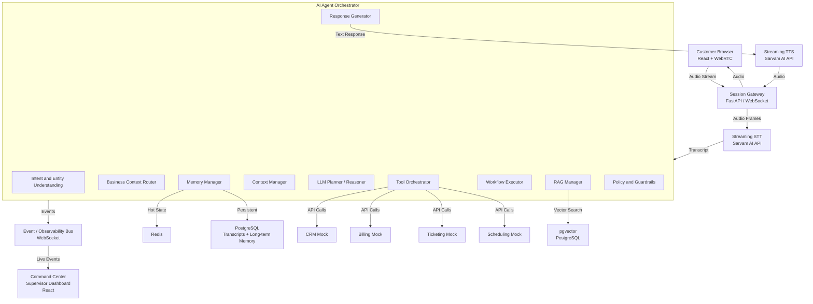

# Command Center 3.0 — Complete Architecture Mindmap

> A definitive reference derived from a complete line-by-line analysis of the project PDF (45 pages), the 4-Pillar block diagram, and the capabilities flow diagram. Every model building this system should treat this as the single source of truth.

---

## 1. WHAT THIS SYSTEM IS

An **AI-first, voice-driven Contact Center** with a real-time **Supervisor Command Center** dashboard. Customers speak naturally; the AI agent reasons, plans, calls enterprise systems, retrieves knowledge, executes workflows, and responds — while a supervisor watches every internal step live.

**Core Architectural Principle (PDF, page 11):**
> The LLM is the dynamic reasoning/planning layer. Deterministic workflows are controlled execution paths inside the agent. Tools and enterprise systems perform real actions. Memory maintains continuity. RAG supplies knowledge. Policy/guardrails constrain the agent.

---

## 2. TARGET SYSTEM ARCHITECTURE (Canonical Reference)

This is the exact architecture being built. Every workstream, every component, every design decision in this document maps to this diagram.

```
                         ┌───────────────────┐
                         │  CUSTOMER BROWSER  │
                         │ React + WebRTC     │
                         └─────────┬─────────┘
                                   │  (Audio Stream — WebRTC)
                                   ▼
                         ┌───────────────────┐
                         │  SESSION GATEWAY  │
                         │  FastAPI/WebSocket│
                         └─────────┬─────────┘
                                   │  (Audio Frames)
                                   ▼
                         ┌───────────────────┐
                         │  STREAMING STT    │
                         │  Sarvam AI API    │
                         └─────────┬─────────┘
                                   │  (Transcript Text)
                                   ▼
        ┌──────────────────────────────────────────────────┐
        │             AI AGENT ORCHESTRATOR                │
        │                                                  │
        │  Intent / Entity Understanding                   │
        │  Conversation State                              │
        │  Memory Manager                                  │
        │  Context Manager                                 │
        │  LLM Planner / Reasoner                          │
        │  Tool Orchestrator                               │
        │  Workflow Executor                               │
        │  RAG Manager                                     │
        │  Policy / Guardrails                             │
        └───────────────┬───────────────┬──────────────────┘
                        │               │
              ┌─────────┘               └─────────┐
              ▼                                   ▼
       ┌──────────────┐                    ┌──────────────┐
       │ ENTERPRISE   │                    │ KNOWLEDGE    │
       │ TOOLS        │                    │ RAG          │
       │              │                    │              │
       │ CRM          │                    │ Policies     │
       │ Billing      │                    │ Manuals      │
       │ Ticketing    │                    │ FAQs         │
       │ Scheduling   │                    │ Products     │
       └──────┬───────┘                    └──────┬───────┘
              │                                   │
              └─────────────────┬─────────────────┘
                                │  (Context + Action Results)
                                ▼
                       ┌──────────────────┐
                       │  RESPONSE LLM    │
                       └────────┬─────────┘
                                │  (Text Response)
                                ▼
                       ┌──────────────────┐
                       │  STREAMING TTS   │
                       │  Sarvam AI API   │
                       └────────┬─────────┘
                                │  (Audio Stream)
                                ▼
                          CUSTOMER VOICE


        ┌─────────────────────────────────────────────┐
        │             COMMAND CENTER                  │
        │         (Supervisor Dashboard — React)      │
        │                                             │
        │  Live conversations                         │
        │  Agent/Planner timeline                     │
        │  Memory                                     │
        │  Tool calls                                 │
        │  RAG sources                                │
        │  Workflow execution                         │
        │  Policy decisions                           │
        │  Analytics                                  │
        │  Call summaries                             │
        └─────────────────────────────────────────────┘
                     ▲
                     │
          Event / Observability Bus
          (WebSocket — all system components emit events)
                     ▲
                     │
             All system components
```

### Architecture Alignment Checklist

Every component in this diagram maps to a fully specified section in this mindmap:

| Architecture Block | Mindmap Section | Technology |
|---|---|---|
| Customer Browser | Section 4.1 | React + TypeScript + WebRTC |
| Session Gateway | Section 4.2 | FastAPI + WebSocket |
| Streaming STT | Section 4.3 | **Sarvam AI API** |
| AI Agent Orchestrator | Section 4.4 (10 sub-systems) | LangGraph / custom stateful |
| Enterprise Tools (CRM/Billing/Ticketing/Scheduling) | Section 4.4.6 | FastAPI mock endpoints |
| Knowledge RAG | Section 4.4.8 | pgvector on PostgreSQL |
| Response LLM | Section 4.4.10 | GPT / Claude / Gemini |
| Streaming TTS | Section 4.3 | **Sarvam AI API** |
| Command Center Dashboard | Section 4.6 (6 screens) | React + WebSocket |
| Event / Observability Bus | Section 4.5 | WebSocket + OpenTelemetry |

---

## 3. THE PROBLEM BEING SOLVED

| Problem | Impact |
|---|---|
| High operational cost of scaling human agents | Linear cost growth |
| Long wait times + inconsistent quality | CSAT drops at peak hours |
| Low First-Contact Resolution (FCR) | Repeated transfers |
| Rigid IVR / rule-based chatbots | Cannot handle multi-intent complex queries |

**Solution:** Real-time voice-first AI Agent + human-in-the-loop Supervisor Command Center.

---

## 3. THE 4-PILLAR ARCHITECTURE (from block diagram image)

```
PILLAR 1: VOICE LAYER (Omnichannel Audio Interface)
  Audio Streaming -> STT -> Text Normalization -> TTS -> Playback
  WebRTC / Real-time bi-directional audio
  STT: Sarvam AI API  (NOT Azure Speech)
  TTS: Sarvam AI API  (NOT Azure Speech)
  Text Normalization: Punctuation, casing, filler words
  Audio Playback: Low latency to customer

PILLAR 2: AI ORCHESTRATION LAYER (Intelligence, Memory, Workflow)
  Intent Detection -> Workflow Engine -> Memory Management
  -> LLM Reasoning -> Policy & Guardrails -> Tool Planner
  Intent Detection: Understand customer intent & entities
  Workflow Engine: Orchestrate business process & next best action
  Memory Management:
    - Conversation Memory
    - Working Memory
    - Customer Memory
    - Enterprise Context
  LLM Reasoning: Reason, plan, generate response with context
  Policy & Guardrails: Compliance, risk, approvals, safety checks
  Tool Planner: Decide which tools/APIs/knowledge to use

PILLAR 3: ENTERPRISE INTEGRATION LAYER (Systems, Tools, Knowledge)
  CRM -> Billing -> Ticketing -> Scheduling -> Knowledge Base (RAG) -> Other Systems
  CRM: Customer profile, account, history
  Billing: Invoices, payments, refunds
  Ticketing: Create/update tickets, case management
  Scheduling: Appointments, engineer visits, resources
  Knowledge Base (RAG): Policies, FAQs, product info, docs
  Other Systems: Orders, inventory, notifications, 3rd party APIs

PILLAR 4: OBSERVABILITY & INTELLIGENCE LAYER
  (Monitoring, Analytics & Continuous Improvement)
  Conversation Logs -> Analytics & Metrics -> Quality Monitoring
  -> Call Summaries -> Insights & Trends -> Data & Model Feedback
  Conversation Logs: Transcripts, events, tool calls, metadata
  Analytics & Metrics: KPIs, latency, CSAT, FCR, containment
  Quality Monitoring: Auto QA, sentiment, compliance
  Call Summaries: AI-generated summaries & dispositions
  Insights & Trends: Topic modelling, trend detection, root cause
  Data & Model Feedback: Feedback loop for continuous learning
```

---

## 4. SYSTEM COMPONENTS — DETAILED BREAKDOWN

### 4.1 Customer Browser (Frontend)

**Technology:** React + TypeScript + WebRTC + WebSocket

**Responsibilities:**
- Microphone access
- WebRTC connection to Session Gateway
- Audio playback of AI voice response
- Connection status display
- Transcript display (optional for customer)
- Call controls (start/end/mute)
- Interruption / barge-in handling
- Conversation state display where appropriate

**Customer experience:** A normal voice conversation. They do not see the internal AI reasoning.

---

### 4.2 Session Gateway

**Technology:** FastAPI + WebRTC/WebSocket

**Purpose:** Deliberately separate from the AI agent. Acts as the junction between the customer audio stream and the AI pipeline.

**Responsibilities:**
- Create and manage conversation session
- Maintain WebRTC/WebSocket connection
- Authenticate session
- Route audio frames to STT
- Correlate audio with conversation_id
- Publish events to the observability bus
- Handle reconnects
- Terminate sessions

**Core data entity:**
```
ConversationSession
-------------------
session_id
customer_id
start_time
channel
status
language
agent_id
```

Everything downstream operates using a shared session_id.

---

### 4.3 Speech Layer (STT + TTS)

> CRITICAL CHANGE FROM PDF: The PDF mentions Azure Speech / Deepgram for STT and Azure Speech / ElevenLabs for TTS. This project uses Sarvam AI API for BOTH STT and TTS.

#### Streaming STT (Speech-to-Text) via Sarvam AI

Responsibilities:
- Streaming transcription (real-time, not batch)
- Partial transcripts (intermediate results)
- Final transcripts
- Timestamps per word/phrase
- Speaker diarization information
- Optional language detection

Key event emitted:
```json
{
  "event": "transcript.final",
  "session_id": "S123",
  "text": "My internet stopped working yesterday",
  "timestamp": "..."
}
```

The AI system consumes events and is NOT tightly coupled to the speech provider. This allows swapping providers without architectural changes.

#### Streaming TTS (Text-to-Speech) via Sarvam AI

- Converts AI text response into natural audio
- Must be streaming (not batch) to minimize perceived latency
- Audio streamed back through Session Gateway to customer browser

---

### 4.4 AI Agent Orchestrator (The Core Cognitive Hub)

> From PDF (page 17): "Do not implement this as one giant prompt. Break it into explicit capabilities."

The orchestrator contains these distinct sub-systems:

```
AI Agent Orchestrator
|
|-- Intent & Entity Understanding
|-- Conversation State
|-- Memory Manager
|-- Context Manager
|-- LLM Planner / Reasoner
|-- Tool Orchestrator
|-- Workflow Executor
|-- RAG Manager
|-- Policy / Guardrails
`-- Response Generator
```

#### 4.4.1 Intent & Entity Understanding

Extracts structured data from the customer utterance:
```json
{
  "intent": ["technical_issue", "billing_issue"],
  "entities": {
    "service": "internet",
    "time": "yesterday"
  },
  "sentiment": "frustrated",
  "urgency": "medium"
}
```

Intent detection is NOT the final decision maker. It provides context to the Planner. The Planner determines that multiple capabilities are required simultaneously.

#### 4.4.2 Business Context Router (formerly "Workflow Selector")

> From PDF (page 8): "I would avoid the term 'Workflow Selector' because it implies old-school RPA. Use 'Business Context Router' or 'Intent & Process Router'."

Routes the conversation to the correct domain context:
```
User Transcript
    |
Intent + Entity Understanding
    |
Business Context Router
    |-- Technical Support Context
    |-- Billing Context
    |-- Sales Context
    `-- Complaint Context
    |
Conversation State Update
    |
AI Agent Planner
```

| Component | Purpose | Example |
|---|---|---|
| Business Context Router | Decide the domain/process | "This is a refund case" |
| AI Agent Planner | Decide steps dynamically | "Get invoice -> check policy -> offer refund" |
| Workflow Executor | Run deterministic processes | "Refund approval flow" |

#### 4.4.3 Memory Management

Three types of memory — all must be implemented:

| Memory Type | Content | Storage |
|---|---|---|
| Short-term conversational memory | "Customer already restarted router", "Customer gave account number", "Outage already explained" | Redis |
| Working memory / task state | customer_verified=true, diagnostics_complete=true, engineer_booking=pending | Redis |
| Long-term customer memory | Previous issues, tickets, plan, preferences, prior interactions | PostgreSQL |

Memory separation (from PDF, page 20):
```
Redis       -> Current session / working state
PostgreSQL  -> Persistent conversation data, transcripts, long-term memory
Customer/CRM -> Enterprise customer history
```

**Session Chat Memory:** The system must support in-session chat memory so the user can reference any previous exchange within the active session. The model must be able to answer "Earlier you mentioned X — can you explain that again?" This is stored in conversational memory and surfaced via the Context Manager.

Do NOT put everything into the LLM prompt. Build a Context Manager that selects only what the LLM actually needs.

#### 4.4.4 Context Manager

Assembles the reasoning context for each LLM call from:
- Current utterance
- Relevant conversation history (selected subset, not all 200 messages)
- Current task state
- Relevant customer profile
- Tool results
- Relevant knowledge passages
- Applicable policies

This prevents context bloat and hallucination from irrelevant information.

#### 4.4.5 Planner / Reasoner (LLM)

The agentic brain. Receives:
- Customer request
- Current conversation state
- Available capabilities (tools, workflows, RAG)
- Policies
- Previous actions

Determines the next action dynamically.

Example:
> User: "My internet stopped yesterday, the bill has an extra charge, and if this isn't fixed I want to cancel."

Planner output:
1. Retrieve customer
2. Check service status
3. Retrieve current invoice
4. Retrieve relevant billing policy
5. Explain the issue
6. Determine whether technical resolution is required
7. If unresolved, offer engineer appointment
8. If customer still requests cancellation, invoke cancellation workflow

This plan changes based on tool results. That is the critical difference from a fixed workflow.

#### 4.4.6 Tool Orchestrator

Every enterprise action is a typed, structured tool:

| Tool | Action |
|---|---|
| get_customer() | Fetch customer profile from CRM |
| get_account() | Fetch account details |
| get_invoice() | Retrieve invoice |
| get_order() | Fetch order details |
| check_outage() | Check service/network status |
| run_diagnostics() | Run connectivity diagnostics |
| create_ticket() | Open a support ticket |
| schedule_engineer() | Book a technician visit |
| cancel_service() | Initiate cancellation |
| issue_refund() | Process a refund |
| send_sms() | Send SMS notification |
| send_email() | Send email |

Each tool must have: name, description, input schema, output schema, authorization rules, timeout, retry policy, audit information.

Security rule: The LLM never has unrestricted access to APIs. It selects a tool. The Tool Orchestrator validates and executes it.

#### 4.4.7 Workflow Executor

For deterministic, multi-step, compliance-critical processes:

Example — Refund Workflow:
```
Verify identity
    |
Check transaction
    |
Check refund eligibility
    |
Check amount threshold
    |
Approval if necessary
    |
Issue refund
    |
Send confirmation
```

Relationship with Planner:
```
LLM Planner -> "Run refund workflow" -> Workflow Executor -> Deterministic business process
```

The AI decides when to run a workflow. The workflow itself is deterministic — much safer than asking an LLM to independently decide every financial step.

#### 4.4.8 RAG Manager (Retrieval-Augmented Generation)

Use RAG for knowledge retrieval, not as the universal answer source.

Knowledge types stored in RAG:
- Refund policy
- Warranty terms
- Product documentation
- Service policy
- Cancellation policy
- Terms & conditions
- Troubleshooting procedures

RAG pipeline:
```
Documents -> Chunking -> Embeddings -> Vector/Search Index -> Retrieval -> Reranking -> Relevant passages -> LLM
```

Demo must support: document upload, indexing, semantic search, metadata filters, citation generation, source display in Command Center.

Storage: pgvector (PostgreSQL extension) — no separate vector database infrastructure needed.

#### 4.4.9 Policy Engine & Guardrails

A first-class subsystem, not an afterthought.

Controls:
- What can the agent say?
- What can it do?
- What requires confirmation?
- What requires human approval?
- What must be escalated?

Policy examples (from PDF):
| Situation | Policy |
|---|---|
| Refund > 10,000 | Manager approval required |
| Customer requests cancellation | Retention policy applies |
| Fraud suspicion detected | No autonomous action |
| Identity not verified | No sensitive account operations |

Separation of concerns:
```
LLM Planner proposes -> Policy Engine authorizes -> Tool Layer executes
```

#### 4.4.10 Response Generator

After all actions are complete, the response LLM receives:
- User request
- Conversation context
- Tool results
- Knowledge passages
- Policy constraints
- Task state

Generates natural language. Example:
> "I found the additional 850 charge. It came from roaming usage on 12 August. Your plan does not include that roaming package. I can arrange a technician visit for tomorrow at 10 AM."

Then passed to Sarvam AI TTS and streamed to customer.

---

### 4.5 Event / Observability Bus

Every component emits structured events. Example event stream for one turn:
```
08:32:10  speech.final
08:32:11  intent.detected
08:32:11  customer.lookup.started
08:32:12  customer.lookup.completed
08:32:12  invoice.lookup.started
08:32:13  invoice.lookup.completed
08:32:13  rag.search.started
08:32:14  rag.search.completed
08:32:14  planner.decision
08:32:15  response.generated
08:32:15  tts.started
```

This event stream powers the Command Center dashboard in real time.

---

### 4.6 Command Center Supervisor Dashboard

The supervisor sees everything the AI does internally.

#### Screen 1 — Live Operations Dashboard
Real-time metrics:
- Active conversations count
- AI containment rate
- Escalation rate
- Average handling time
- Average response latency
- Tool failure rate
- Customer sentiment distribution

#### Screen 2 — Conversation Monitor
For each selected active conversation:
- Real-time transcript (user + AI side by side)
- Customer context (profile)
- Detected intent
- Sentiment indicator
- Current workflow state
- Tools called with args and results
- RAG sources retrieved
- Policy decisions made

#### Screen 3 — Agent / Workflow Timeline
Visual timeline showing exactly what happened and when:
```
Customer speaks -> Intent detected -> CRM lookup -> Invoice retrieved ->
Policy retrieved -> Planner updated -> Refund workflow started -> Refund completed -> SMS sent
```

#### Screen 4 — Knowledge Explorer
Shows RAG process: Question -> Retrieved documents -> Relevant passages -> Answer

#### Screen 5 — Tool / Integration Monitor
Live health status of all enterprise integrations.

#### Screen 6 — Analytics & Call Summaries
- Auto-generated post-call summary
- Classification tags
- Sentiment progression graph
- Key performance metrics

---

## 5. DATA MODEL (PostgreSQL)

```
Customer
Account
Conversation
    |-- Messages
    |-- ConversationState
    |-- Memory (short-term + long-term references)
    |-- Intents
    |-- Planner decisions
    |-- ToolExecutions
    |-- RAG Retrievals
    |-- Policy Decisions
    |-- WorkflowExecutions
    `-- CallSummary

KnowledgeDocument
KnowledgeRetrieval
Policy
PolicyDecision
Tool
AgentAction
Escalation
```

Every call is fully replayable from the database. Supervisors can reconstruct the entire execution of any past conversation.

---

## 6. TECHNOLOGY STACK (WITH REQUIRED CHANGES)

| Layer | Original PDF | This Project |
|---|---|---|
| Frontend | React + TypeScript | React + TypeScript |
| Voice transport | WebRTC | WebRTC |
| Session/API | FastAPI | FastAPI |
| Event transport | WebSocket | WebSocket |
| STT | Azure Speech / Deepgram | **Sarvam AI API** |
| TTS | Azure Speech / ElevenLabs | **Sarvam AI API** |
| LLM | GPT / Claude / Gemini | GPT / Claude / Gemini |
| Agent orchestration | LangGraph or custom | LangGraph or custom stateful orchestrator |
| Session + working state | Redis | Redis |
| Persistent data | PostgreSQL | **PostgreSQL** (transcripts + long-term memory) |
| RAG storage | Azure AI Search / pgvector | **pgvector** (PostgreSQL extension) |
| Observability | OpenTelemetry + Langfuse | OpenTelemetry + Langfuse |
| Containerization | Docker | **No Docker** |
| Deployment | Kubernetes / Docker Compose | Direct local / simple hosting |

---

## 7. BUSINESS CAPABILITIES (from capabilities diagram)

The system must fulfill all of the following:

| Capability | Description |
|---|---|
| Multi-turn voice conversation | State and memory management across turns |
| Intent and sentiment detection | Understand what the customer wants and how they feel |
| ERP lookup | Retrieve account from CRM |
| RAG — Explain policy | Answer policy questions from knowledge base |
| Tool calling | Execute refund, log ticket, check status |
| Workflow engine | Follow business process (deterministic flows) |
| Intelligent escalation | Customer angry + issue unresolved -> escalate |
| Human handoff | Transfer to human agent with full context |
| Call summary | Generate after-call report automatically |
| Observability | Quality monitoring, event logging |

---

## 8. END-TO-END CALL FLOW

```
[Customer Browser - React/WebRTC]
    | (1) Stream Audio
    v
[Session Gateway - FastAPI/WebSocket]
    | (2) Audio Frames
    v
[Streaming STT - Sarvam AI]
    | (3) Transcript text
    v
[AI Agent Orchestrator]
    | (4) Intent Detection
    | (5) Business Context Routing
    | (6) Memory + Context Assembly
    | (7) LLM Planner -> Dynamic Plan
    | (8) Tool Execution (CRM / Billing / Ticketing / Scheduling)
    | (9) RAG Query (if policy/knowledge needed)
    | (10) Policy Guardrail Check
    | (11) Response Generation (LLM)
    | (12) Emit events to Observability Bus
    v
[Streaming TTS - Sarvam AI]
    | (13) Synthesized audio stream
    v
[Session Gateway] -> [Customer Browser] -> Customer hears AI voice

[Event / Observability Bus]
    | (all events from every step above)
    v
[Command Center Dashboard - React]
    -> Supervisor sees transcript, tools, RAG, sentiment, workflows live
```

---

## 9. CHAT MEMORY REQUIREMENT

The user must be able to reference any prior message during an active session and the model must answer correctly.

Implementation:
- All conversation turns stored in Message table (PostgreSQL) with conversation_id, timestamp, role, content
- Short-term session context maintained in Redis for fast access during active call
- Context Manager surfaces relevant prior messages when the user references them
- Long-term memory persists after call ends and is available in future sessions via PostgreSQL
- The system must be capable of answering: "Earlier you said the charge was 850 — where exactly did that come from?"

---

## 10. COMPLEX TEST QUERIES THE SYSTEM MUST HANDLE

These are the exact multi-intent queries from the PDF (pages 9-10) that serve as the benchmark for system capability:

1. "My internet has been slow for the past week, I was billed extra this month, and I am thinking of cancelling because this keeps happening."
2. "I was charged twice for my last payment, my service is still not active, and I need this fixed before tomorrow."
3. "I want to upgrade my plan because my current one is too slow, but I also noticed an unexpected charge on my latest bill."
4. "My delivery is delayed, I was promised it would arrive yesterday, and I want to know if I can get a refund."
5. "I cancelled my subscription last month, but I was charged again today and I want my money back."
6. "My phone was stolen, I need to block the SIM, transfer my number to a new device, and check if someone used my data."
7. "I am moving to a new house next week, I need my service transferred, but I also want to know if my current plan is still the best option."
8. "My payment failed yesterday, but the money has already been deducted from my bank account. Can you check what happened?"
9. "I have been having connection issues since the technician visited, and I was also charged for the service visit even though the problem was not fixed."
10. "I want to cancel my account, but before I do that, tell me what charges I will have to pay and whether there is a better plan available."
11. "My bill is much higher than usual. I travelled last month, but I don't understand these roaming charges. Can you explain and help me reduce the bill?"
12. "I ordered a new device, the payment went through, but I received the wrong model. I want an exchange and a refund for the price difference."
13. "I have already contacted support twice about my issue, nobody resolved it, and I want this escalated to someone who can actually help."
14. "My service stopped working while I was travelling, I need to know if it is a network problem or something wrong with my account."
15. "I want to upgrade my internet speed, but first check whether my area supports the higher plan and whether I qualify for any discounts."
16. "I was promised a promotional discount when I signed up, but my first bill does not include it. Can you check my agreement and fix it?"
17. "My account was charged after I returned the equipment, and I want to know why there is still an outstanding balance."
18. "I need to add a family member to my account, but I also want to change the payment method and understand the impact on my bill."
19. "The app shows my payment as pending for three days, my service is restricted, and I need to know when it will be restored."
20. "I am unhappy with the service quality, I want compensation for the outage, and if that is not possible I want to cancel."
21. "My WiFi works on some devices but not others, I already restarted everything, and I need help troubleshooting this."
22. "I received an email saying my plan is changing next month. I want to know why, what the new charges are, and whether I can opt out."
23. "I need a copy of my previous invoices for tax purposes, but I also noticed one invoice has incorrect charges."
24. "My account was suspended even though I paid the bill. Please check my payment, restore my service, and tell me what caused the suspension."
25. "I want to switch providers, but before I leave, tell me if you can offer a better plan based on my usage history."

### Definition of Done Scenario (from PDF, page 42)

> "My internet stopped working yesterday, the bill also has an extra charge I don't understand, and I'm considering cancelling because this has happened before."

The system must:
- Understand multiple intents simultaneously
- Retrieve customer profile from CRM
- Remember prior issue from long-term memory
- Check service status
- Retrieve invoice
- Search relevant policy via RAG
- Dynamically plan next actions
- Call multiple enterprise tools
- Execute a deterministic workflow when required
- Maintain state across turns
- Detect sentiment (flag "Frustrated")
- Apply policy guardrails
- Explain results naturally in voice
- Create a ticket
- Schedule engineer
- Escalate when required
- Produce a post-call summary
- Show the complete execution timeline in Command Center

---

## 11. DEVELOPMENT WORKSTREAMS (from PDF, pages 33-34)

| Workstream | Scope |
|---|---|
| W1 | Frontend + WebRTC |
| W2 | Session Gateway + Realtime Events |
| W3 | STT/TTS (Sarvam AI) |
| W4 | AI Agent Orchestrator |
| W5 | Memory + State (Redis + PostgreSQL) |
| W6 | Tools + Mock Enterprise APIs |
| W7 | RAG (pgvector) |
| W8 | Workflow Executor |
| W9 | Policy / Guardrails |
| W10 | Command Center UI |
| W11 | Observability |
| W12 | Demo Scenarios + Integration |

---

## 12. 8-WEEK DELIVERY ROADMAP

| Week | Focus | End-of-Week Demo |
|---|---|---|
| 1 | React app, WebRTC, backend skeleton, event schema, STT/TTS | Customer speaks -> transcript -> AI speaks back |
| 2 | Intent detection, conversation state, basic LLM, session memory | Multi-turn with context |
| 3 | Mock CRM/Billing/Ticketing/Scheduling, tool schemas + routing | Customer asks transactional question, agent queries and responds |
| 4 | LLM Planner, dynamic tool selection, multi-step calls, context manager | Voice bot becomes AI Agent that plans sequences |
| 5 | Knowledge ingestion, RAG retrieval, citations, long-term memory, policy engine, guardrails | Agent answers policy questions, blocks unsafe actions |
| 6 | Command Center dashboard, WebSocket subscription, timeline UI, tool/memory/workflow views | Live dashboard showing all internal steps |
| 7 | Latency optimization, retries, barge-in detection, session recovery, escalation | Graceful failure recovery, interruption handling |
| 8 | 3-5 polished demo scenarios, pre-seeded data, failure demonstrations | Final demo-ready system |

---

## 13. MVP vs FULL SCOPE

### MVP — Minimum Credible System
```
WebRTC + STT (Sarvam) + Agent Planner + Memory + 3-5 Tools + RAG + Workflow Executor + TTS (Sarvam)
```

With one complete workflow:
```
Technical Issue -> CRM lookup -> Outage check -> Diagnostics -> Engineer booking -> Ticket creation
```

### Full Demo — Add On Top of MVP
- Multiple workflows
- Multi-step planning
- Long-term memory (PostgreSQL)
- Policy engine
- Sentiment tracking
- Human escalation
- Command Center dashboard
- Call summaries
- Analytics
- Failure handling

---

## 14. WHAT NOT TO BUILD

- Actual telecom / PSTN infrastructure
- Full CRM product
- Full ticketing product
- Full workforce management
- Production-grade IAM / SSO
- Huge separate vector database
- Complex Kubernetes orchestration

Mock enterprise systems behind clean APIs. The audience cares that AI -> CRM -> result works reliably.

---

## 15. CRITICAL ARCHITECTURAL DECISIONS

1. Build event contracts and orchestrator interfaces first. Once stable, all workstreams can evolve independently in parallel.
2. Never one giant prompt. The orchestrator is a collection of distinct capabilities, each with its own responsibility.
3. Sarvam AI for all voice I/O. STT and TTS both use Sarvam AI API. Azure Speech is not used anywhere.
4. No Docker. Run services directly for a simpler development environment.
5. PostgreSQL as the primary persistent store — for transcripts, long-term memory, call summaries, all relational data, and pgvector for RAG embeddings.
6. Redis for hot session state — current turn context, working memory, active workflow state.
7. Chat memory is mandatory. The user can ask the AI about anything said earlier in the session. The system must answer correctly using stored conversation history.
8. The LLM proposes; the Policy Engine authorizes; the Tool Layer executes. This separation is non-negotiable for safety and auditability.
9. All code must reflect the purpose of the system. No filler comments, no generic boilerplate. Every line of code and every comment must be purposeful and specific to this contact center use case.

---

## 16. ARCHITECTURE DIAGRAM



---

*Derived from the complete 45-page PDF, the 4-Pillar block diagram, and the capabilities flow diagram. All user-specified technology changes have been incorporated: Sarvam AI for STT/TTS, PostgreSQL for persistence and RAG, no Docker, session chat memory, no unnecessary comments in code.*
